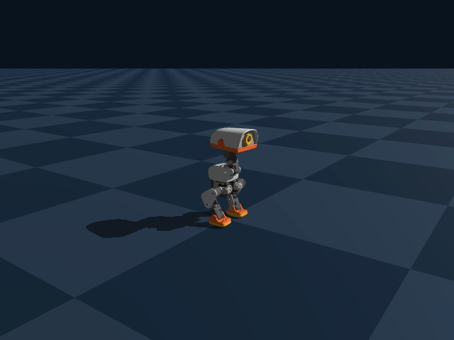

# MicroDuck Locomotion



Train MicroDuck, a 15 cm tall bipedal duck robot, to follow velocity commands with reinforcement learning.

## Purpose

Legged locomotion is one of the most mature applications of reinforcement learning in embodied AI: thousands of robots run in parallel in simulation, and PPO learns a policy that maps a desired velocity to joint position targets. 

This homework provides a complete, compact and readable training pipeline. The goal is not to write PPO from scratch, but to:

- **Understand a real RL training system**: how the environment is organized (commands, observations, actions, rewards, terminations) and how data flows through PPO (rollout → GAE → update);
- **Understand design choices through ablations**: every default in the code is there for a reason. What happens when you remove it, and why?
- **Support conclusions with data**: training curves, play statistics and videos, not intuition.

Code layout:

```
configs/                   # hydra configs
  env/velocity.yaml        # commands, actions, observations, rewards, terminations
  robot/microduck.yaml     # joints, PD gains, feet
  algo/ppo.yaml            # networks and PPO hyperparameters
src/microduck/
  env/environment.py       # Genesis simulation environment
  env/mdp/                 # command / action / observation / reward / termination
  algorithm/               # PPO, networks, distributions, normalization, rollout storage, GAE, logging
scripts/
  train.py                 # training
  play.py                  # replay the newest checkpoint and record a video
```

## Installation

### 1. Install uv

Install [uv](https://docs.astral.sh/uv/) using the instructions for your operating system.

### 2. Install the project environment

```bash
git clone https://github.com/xiaohu-art/MicroDuck.git
cd MicroDuck

uv sync                  # macOS (Apple Silicon, Metal GPU backend)
uv sync --extra cuda     # Linux / Windows with an NVIDIA GPU
uv sync --extra cpu      # Linux / Windows without a GPU
```

Without a GPU, add `backend=cpu` to the training command (see below).

## Basic Commands

### Training

```bash
uv run scripts/train.py
```

Any config value can be overridden on the command line with hydra, e.g.:

```bash
uv run scripts/train.py seed=1
uv run scripts/train.py \
  backend=cpu \
  env.sim.num_envs=512
uv run scripts/train.py \
  algo.max_iterations=2000 \
  algo.algorithm.learning_rate=5e-4
```

Each run creates a directory `outputs/<date>/<time>/` containing:

| File | Content |
|---|---|
| `model_*.pt` | checkpoint saved every `save_interval` iterations |
| `events.out.tfevents.*` | TensorBoard logs |
| `.hydra/config.yaml` | the full config of this run (read by `play.py`) |

### Training curves

```bash
uv run tensorboard --logdir outputs
```

Key metrics:

- `Metrics/error_vel_xy`, `Metrics/error_vel_yaw`: linear / angular velocity tracking error (lower is better)
- `Train/mean_episode_length`: episode length (falling ends an episode early)
- `Episode_Reward/*`: individual reward terms
- `Episode_Termination/*`: fraction of each termination reason
- `Policy/mean_std`: exploration noise of the policy

### Playing a policy

```bash
uv run scripts/play.py              # with the viewer
uv run scripts/play.py --headless   # without the viewer
```

`play.py` loads the newest checkpoint under `outputs/` and runs 7 command segments of 5 s each: stand, forward, backward, left, right, turn left, turn right. At the end it prints the command and the measured average velocity of each segment, and saves a video to `videos/` in the run directory.

## Assignments (100 points)

Compare every experiment against the baseline (default config). **Change one thing only**; keep all other settings, the random seed and the number of iterations the same. For each experiment, your report should include:

1. the relevant training curves, plotted together with the baseline;
2. the summary table printed by `play.py` and recorded video;
3. the differences you observe, and **why** they happen.

### 1. Train the baseline (20 points)

Train with the default config, then play the resulting checkpoint. Use its curves, schedule summary, and video as the baseline for the experiments below.

```bash
uv run scripts/train.py
uv run scripts/play.py
```

### 2. No standing / turn-in-place environments (15 points)

```bash
uv run scripts/train.py \
  env.command.standing_prob=0 \
  env.command.turn_in_place_prob=0
```

By default, a fraction of the environments sample a zero command (standing) or a pure yaw-rate command (turning in place). Without them, how does the policy behave in the stand, turn left and turn right segments of `play.py`? Why are uniformly sampled commands not enough to learn these behaviors?

### 3. No privileged observations for the critic (15 points)

```bash
uv run scripts/train.py \
  'algo.obs_groups.critic=[policy]'
```

By default, the critic receives base linear velocity, foot contacts, and foot air time in addition to the actor's observations. This override makes the critic use the `policy` observation group, matching the actor. How does this affect value fitting (`Loss/value`) and velocity tracking? What is the benefit of giving the critic privileged observations?

### 4. No running observation normalization (15 points)

```bash
uv run scripts/train.py \
  algo.actor.obs_normalization=false \
  algo.critic.obs_normalization=false
```

Observation terms have very different scales (joint velocities, gravity direction, commands, ...). Whta is the effect of observation normalization? Without normalization, does training become slower or less stable?

### 5. Action clipping: `clip: null` vs. `clip: 1.0` (15 points)

```bash
uv run scripts/train.py \
  env.action.clip=1.0
```

By default, the policy output is not clipped. With clipping to [-1, 1], look at `Policy/mean_std` and `Metrics/error_vel_yaw`, and describe the robot's behavior in the video. Explain from the perspective of a Gaussian policy: once actions are clipped, what does the exploration noise beyond the range mean for the return and for the gradient?

### 6. Lateral walking (20 points)

In the baseline, measured lateral velocity during the left and right segments is substantially below the commanded velocity. Investigate the cause, propose one targeted change, and test whether it improves lateral tracking. Your report should include:

- your hypothesis, supported by evidence such as reward terms, joint motion, or gait;
- the change you made and why it addresses the suspected cause;
- baseline-versus-modified lateral tracking, plus any effects on forward, backward, and turning performance.

## References

1. [Genesis-World](https://github.com/Genesis-Embodied-AI/Genesis)
2. [microduck_rl](https://github.com/pollen-robotics/microduck_rl)
3. [RLX](https://github.com/noahfarr/rlx)